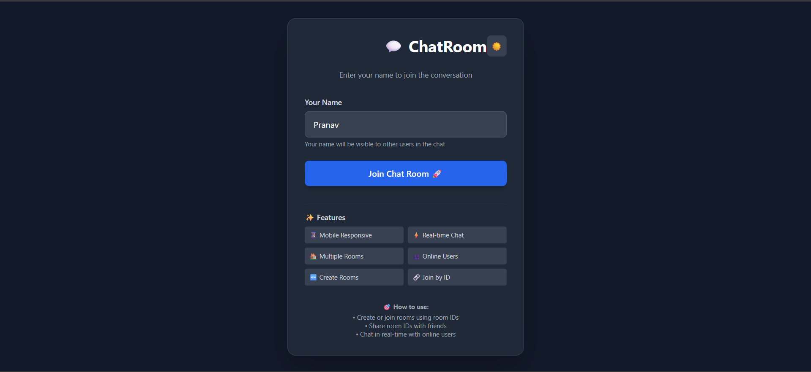
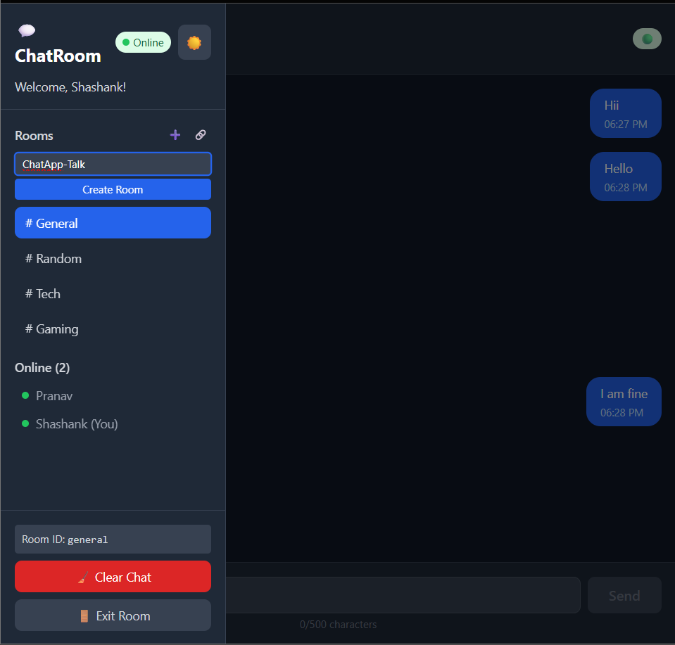
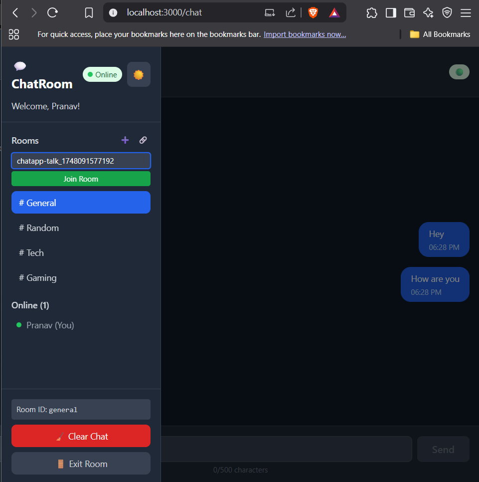
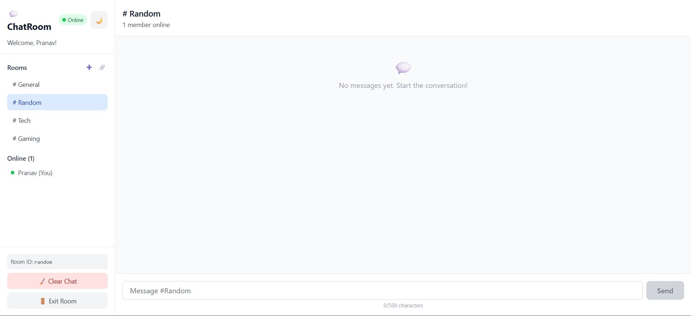
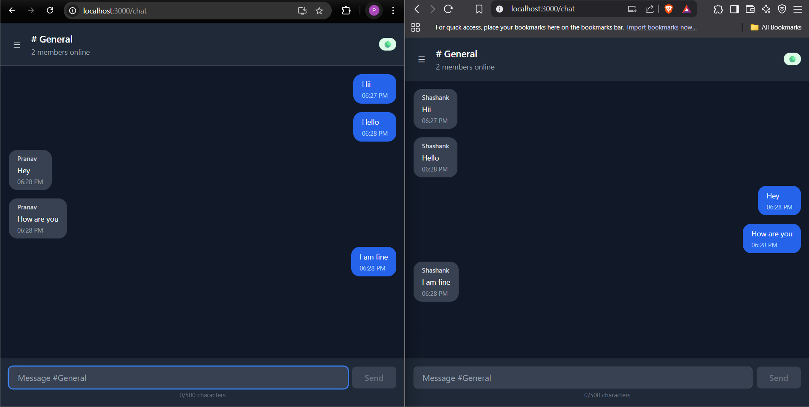
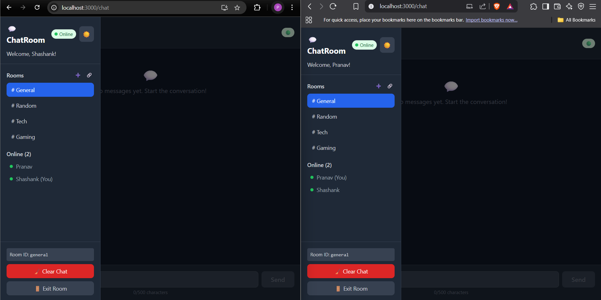

# 💬 ChatApp - Real-Time Chat Application

A modern, feature-rich real-time messaging application built with React.js and Node.js, featuring multiple chat rooms, real-time messaging, and a beautiful responsive UI with dark mode support.

## ✨ Features

### 💬 Real-Time Messaging
- Built using **Socket.io** and **Firebase Firestore**
- Instant message updates with **timestamps**, **sender names**, and **smooth UX**

### 🏠 Chat Room System
- Create custom rooms or join existing ones using unique room IDs
- Share room IDs to invite others to your chat room
- Join or leave rooms with a clean session flow

### 👥 Online Users Display
- View a live list of **online users** in the current room
- Automatically updates when users join or leave

### 🌓 Light & Dark Mode
- Toggle between **light and dark themes** with a single click
- Clean and accessible UI in both modes

### 📱 Responsive Design
- **Mobile-first design** optimized for all screen sizes
- **Collapsible sidebar** and smooth layout on mobile devices

### 🧩 UI & UX Enhancements
- **Clear Chat** button to reset chat history
- **Loading indicators** and transitions for better user experience
- Smooth animations and a modern, intuitive interface

### 🔐 User Input Handling
- Name-based login for room entry
- **Input validation** with character limits and required fields

### 🔄 Connection Handling
- **Auto-reconnection** support for temporary network drops

### 💾 Message Persistence
- All messages are **stored in Firebase Firestore** for consistency across sessions

### 🏠 Default Rooms 
- Pre-configured rooms like **General**, **Tech**, **Gaming**, and **Random** for quick access

---

## 🛠️ Technology Stack

### Frontend
- **React.js** (Functional Components & Hooks)
- **React Router DOM** - Client-side routing
- **Socket.io Client** - Real-time communication
- **Tailwind CSS** - Styling and responsive design

### Backend
- **Node.js** - Server runtime
- **Express.js** - Web framework
- **Socket.io** - WebSocket implementation
- **Firebase Firestore** - Database and real-time data
- **Firebase Admin SDK** - Server-side Firebase operations

---

## 📁 Project Structure

```
chat-app/
├── 📂 chat-app/                    # React Frontend
│   ├── 📂 node_modules/
│   ├── 📂 src/
│   │   ├── 📂 components/
│   │   │   ├── 📄 ChatDashboard.jsx    # Main chat interface
│   │   │   └── 📄 LoginSignup.jsx      # User authentication
│   │   ├── 📄 App.js                   # Main app component
│   │   ├── 📄 firebase.js              # Firebase credentials
│   │   ├── 📄 index.js                 # React entry point
│   │   └── 📄 ... (other React files)
│   └── 📄 package.json
├── 📂 server/                      # Node.js Backend
│   ├── 📂 firebase/
│   │   └── 📄 serviceAccountKey.json   # Firebase credentials (not included)
│   ├── 📄 index.js                     # Server entry point
│   └── 📄 package.json
└── 📄 README.md
```

---

## 🚀 Setup Instructions

### Prerequisites
- Node.js (v14 or higher)
- npm or yarn
- Firebase project with Firestore enabled

### 1. Clone the Repository
```bash
git clone https://github.com/pranavpawar11/ChatApp.git
cd chatapp
```

### 2. Firebase Setup
> **⚠️ Security Note:** Firebase credentials are not included in this repository for security reasons.

1. Create a Firebase project at [Firebase Console](https://console.firebase.google.com/)
2. Enable Firestore Database
3. Generate a service account key:
   - Go to Project Settings → Service Accounts
   - Generate new private key
   - Save the JSON file as `server/firebase/serviceAccountKey.json`

### 3. Backend Setup
```bash
cd server
npm install

# Create environment file
echo "GOOGLE_APPLICATION_CREDENTIALS=./firebase/serviceAccountKey.json
CLIENT_URL=http://localhost:3000
PORT=5000" > .env

# Start the server
npm start
```

### 4. Frontend Setup
```bash
cd chat-app
npm install

# Create environment file (optional)
echo "REACT_APP_SERVER_URL=http://localhost:5000" > .env

# Start the React app
npm start
```

### 5. Access the Application
- Frontend: http://localhost:3000
- Backend: http://localhost:5000

---

## 🔧 Environment Variables

### Server (.env)
```env
GOOGLE_APPLICATION_CREDENTIALS=./firebase/serviceAccountKey.json
```

### Client (.env) 
```env
REACT_APP_SERVER_URL=http://localhost:5000
```
---

## 📸 Screenshots
## 🔐 Login Screen
  
*A clean, modern login interface with a dark mode toggle and mobile-friendly layout.*

---

## 🏠 Create Room
  
*Users can create new chat rooms with unique IDs and custom names.*

---

## 🏠 Join Room
  
*Easily join existing rooms using their unique room ID.*

---

## 💬 Chat Interface – Light Mode
  
*Main chat interface in light mode showing messages, users, and typing indicator.*

---

## 🌙 Chat Interface – Dark Mode
  
*Elegant dark mode chat interface with blue accent colors and message history.*

---

## 👥 Online Users Panel
  
*Displays online users in the current room with real-time updates.*

---

## 🎥 Demo Video
👉 [Watch the full demo here](screenshots/onlineUsers.png)  

---

## 🎯 Key Implementation Highlights

### React Architecture
- **Functional Components** with modern React Hooks
- **Custom State Management** using useState and useEffect
- **React Router DOM** for seamless navigation
- **Component Reusability** with props and event handling

### Real-Time Features
- **Socket.io Integration** for instant messaging
- **Firebase Firestore** for message persistence
- **Auto-Reconnection Logic** for robust connectivity
- **Real-Time User Tracking** across all rooms

### User Experience
- **Responsive Design** using Tailwind CSS utility classes
- **Loading States** and error handling
- **Mobile-First Approach** with collapsible navigation
- **Smooth Animations** and transitions

## 🔐 Security Features
- Firebase credentials are gitignored for security
- Input validation and sanitization
- CORS configuration for API security
- Environment variables for sensitive data

## 📝 Assignment Compliance

This project fully meets all the internship assignment requirements:

### ✅ Core Features Implemented
- [x] User Login/Join functionality
- [x] Chat Room Interface with timestamps and sender info
- [x] Send New Message capability
- [x] Clear Chat and Exit Room features

### ✅ Bonus Features Implemented
- [x] Real-time messaging with Socket.io and Firebase
- [x] Multiple Chat Rooms with create/join functionality
- [x] Online Users List
- [x] Responsive Design for Mobile
- [x] Dark Mode Toggle

### ✅ Technical Guidelines Followed
- [x] React Functional Components & Hooks
- [x] React Router DOM for routing (/, /room/:id)
- [x] Real-time with Socket.io and Firebase
- [x] State management with useState and useEffect
- [x] Tailwind CSS for styling

## 👨‍💻 Developer

**Pranav Pawar**
- GitHub: [@pranavpawar11](https://github.com/pranavpawar11)
- LinkedIn: [Pranav Pawar](https://www.linkedin.com/in/pranav-pawar-4a37092b7/)
- Portfolio: [Pranav Pawar](https://6828739229acb1ade3de3e02--pranavpawar745.netlify.app/)
- Email: pranavpawar745@gmail.com


⭐ **If you found this project helpful, please give it a star!** ⭐
